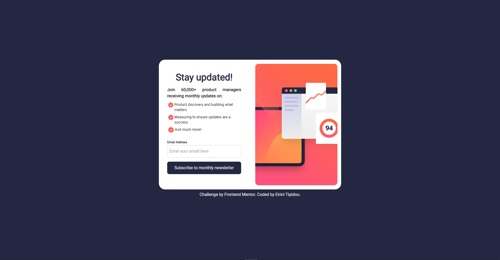

# Frontend Mentor - Newsletter sign-up form with success message solution

This is a solution to the [Newsletter sign-up form with success message challenge on Frontend Mentor](https://www.frontendmentor.io/challenges/newsletter-signup-form-with-success-message-3FC1AZbNrv). Frontend Mentor challenges help you improve your coding skills by building realistic projects. 

## Table of contents

- [Overview](#overview)
  - [The challenge](#the-challenge)
  - [Screenshot](#screenshot)
  - [Links](#links)
- [My process](#my-process)
  - [Built with](#built-with)
  - [Continued development](#continued-development)
  - [Useful resources](#useful-resources)
- [Author](#author)

## Overview

### The challenge

Users should be able to:

- Add their email and submit the form
- See a success message with their email after successfully submitting the form
- See form validation messages if:
  - The field is left empty
  - The email address is not formatted correctly
- View the optimal layout for the interface depending on their device's screen size
- See hover and focus states for all interactive elements on the page

### Screenshot

##Landing Page

##Active state of buttons and input

##Ivalid email entered message

##Success message

### Links

- Solution URL: [solution URL](https://your-solution-url.com)
- Live Site URL: [live site URL](https://your-live-site-url.com)

## My process

### Built with

- Flexbox
- CSS Grid
- [React](https://react.dev/) - JS library
- [TailwindCSS](https://tailwindcss.com/) - CSS Framework

### Continued development

I encountered a problem with the svg files, where the visibility tags with TailwindCSS were not working properly, thus not making possible to create a fully responsive interface for mobile devices.

### Useful resources

- [How to Pass Data and Events Between Components in React](https://www.freecodecamp.org/news/pass-data-between-components-in-react/) - This article contains very usefull information about passing data between Components. Child to Parent is trickier than Parent to Child and the article made it easy to understand both.

## Author

- Website - [Eirini Tipidou](https://www.your-site.com)
- Frontend Mentor - [@Raven-Ir](https://www.frontendmentor.io/profile/Raven-Ir)
